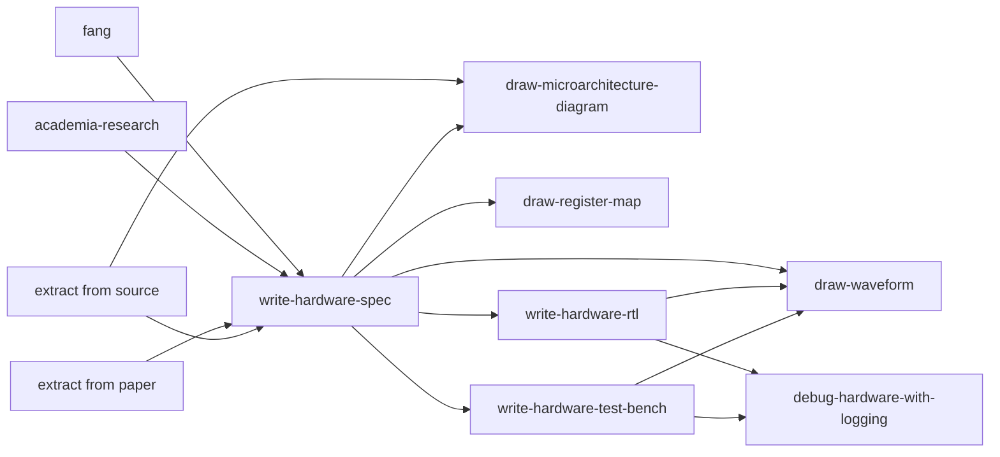

# AI agent skills for system architects

A set of skills for silicon system architects, from architecture to RTL in software hardware co-design.

## Skills

### Research & knowledge extraction

- **[academia-research](academia-research/SKILL.md)** — Answer a focused academic question or compare a body of work from primary sources. Produces a concise Markdown report with claim-level citations, comparable quantitative evidence, figures extracted from source PDFs or web pages, limits, and open questions.
- **[extract-architecture-knowledge-from-source](extract-architecture-knowledge-from-source/SKILL.md)** — Turn a reference codebase into standalone documentation for reimplementation without later source access. Records source identity, traceable evidence, behavior, interfaces, algorithms, and verified gaps.
- **[extract-architecture-knowledge-from-paper](extract-architecture-knowledge-from-paper/SKILL.md)** — Turn a paper and its accessible artifacts into standalone, implementation-ready architecture documentation. Separates stated facts, supported inferences, missing details, and user decisions.

### Problem framing

- **[fang](fang/SKILL.md)** — Turn an idea into an agreed intent brief before solution work. Drafts from available evidence, asks material questions in batches or fast-captures a small task in one pass, and requires full-document confirmation before alignment.

### Specification

- **[write-hardware-spec](write-hardware-spec/SKILL.md)** — Create, update, review, or freeze the architecture and microarchitecture contract for an RTL block. Covers interfaces, protocols, timing, reset, state, pipelines, traceable verification, and explicit review gates.

### Visualization

- **[draw-microarchitecture-diagram](draw-microarchitecture-diagram/SKILL.md)** — Create architecture and microarchitecture block diagrams from declarative Python, with semantic blocks, named ports, linted layout, and SVG output.
- **[draw-waveform](draw-waveform/SKILL.md)** — Create focused digital timing diagrams from WaveJSON for handshakes, protocol transactions, latency, clocks, resets, and pipeline occupancy.
- **[draw-register-map](draw-register-map/SKILL.md)** — Create validated register and fixed-format bit-field SVGs with matching Markdown field tables.

### Implementation

- **[write-hardware-rtl](write-hardware-rtl/SKILL.md)** — Write or review synthesizable SystemVerilog for Verilator simulation. Preserves repository conventions and emphasizes exact widths, reset and protocol safety, useful observability, and project-native verification.
- **[write-hardware-test-bench](write-hardware-test-bench/SKILL.md)** — Write SystemC testbenches for Verilator `--sc` models. Scales the harness to the design and covers protocol-derived timing, scoreboards, negative windows, completion, diagnostics, and project integration.

### Debug

- **[debug-hardware-with-logging](debug-hardware-with-logging/SKILL.md)** — Diagnose RTL simulation failures without a waveform viewer. Reproduces the failure, adds selective text evidence, finds the first bad event, tests a concrete hypothesis, and reports the root cause without silently implementing a fix.

## How they fit together

- Research and extraction skills produce the design knowledge and reference docs.
- FANG confirms the problem before solution work when framing is still unclear.
- The spec skill defines and reviews behavior and verification intent before implementation starts.
- Diagram, waveform, and register-map skills turn verified design facts into focused visual documentation.
- RTL and testbench skills implement the spec with the logging/assertion conventions the debug skill relies on.
- The debug skill closes the loop when simulation fails.
