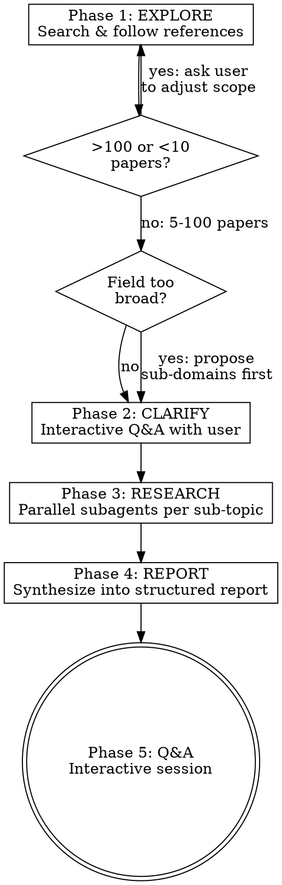
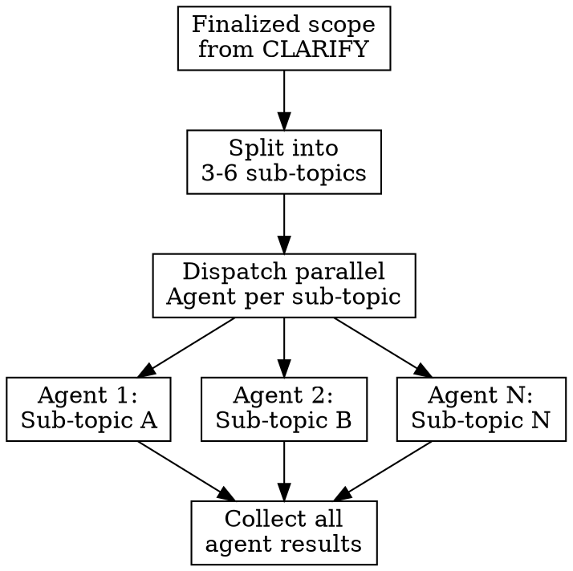

# Independent Research

## Overview

A five-phase workflow for academic research using only Claude Code's native capabilities: explore the field via web search, optionally clarify scope, conduct deep parallel research via subagents, synthesize into ONE structured report opening with a full-scope TL;DR, then enter interactive Q&A.

**Core principles:**
- Do NOT skip phases. Each phase produces artifacts the next phase depends on.
- Produce exactly ONE output file: `[topic].md`, opening with a full-scope TL;DR
- Prioritize arxiv papers, tech reports, and official publications over social media discussions
- Prioritize recent materials — start searches with the current year and work backwards
- Minimize clarifying questions (0-2 max) — the report covers technical and business angles by default

## Process Flow



## Phase 1: EXPLORE

**Goal:** Map the research landscape. Find key papers, identify themes, understand scope.

### Search Strategy

1. **Initial search:** Use WebSearch to find papers and blog posts:
   - Academic (HIGHEST priority): arxiv.org preprints, top venues (NeurIPS, ICML, ICLR, CVPR, ACL, EMNLP, ISCA, MICRO, ASPLOS, SIGCOMM, OSDI, SOSP, etc.)
   - Technical reports & whitepapers (HIGH priority): Official tech reports from labs and companies
   - Industry blogs (MEDIUM priority): Google AI Blog, Meta AI, OpenAI Blog, Anthropic Research, Apple ML Research, Qualcomm AI Research, Microsoft Research, NVIDIA Technical Blog, DeepMind
   - **DEPRIORITIZE:** Reddit threads, Hacker News comments, Medium posts, Twitter/X threads — use these only to discover paper references, never as primary sources
   - **ALWAYS prefer the most recent materials** — sort and prioritize by recency. For a given topic, start searches with the current year and work backwards.
   - Use WebFetch to read paper abstracts and identify key references

2. **Iterative reference following (3 levels deep):**
   - Level 1: Papers found from initial search
   - Level 2: Key references cited by Level 1 papers
   - Level 3: Key references cited by Level 2 papers
   - **Prioritize:** Recent papers (last 2-3 years), top-tier venues, high-citation works, seminal/foundational papers

3. **Paper count guardrails:**
   - If **>100 papers** found: STOP. Present findings to user and ask how to narrow scope (suggest sub-domains, time range, specific angles)
   - If **<10 papers** found: STOP. Present findings and ask user to broaden scope or suggest adjacent search terms
   - Target: **15-60 papers** for a well-scoped survey

4. **Sub-domain detection:** If the field naturally splits into 3+ distinct sub-areas, propose a breakdown to the user before proceeding. Let them choose which sub-domains to include.

### Explore Output

Present to the user:
- **Field overview:** 2-3 sentence summary of the landscape
- **Key themes:** List of identified sub-areas/themes
- **Paper count:** How many papers found at each level
- **Top papers:** 5-10 most important papers with one-line descriptions
- **Suggested scope:** Your recommendation for what to focus on

## Phase 2: CLARIFY

**Goal:** Quickly confirm scope. This phase should be MINIMAL — the single report covers technical and business angles by default, which eliminates most scope questions.

**Default assumptions (skip asking about these):**
- Time range: Last 3 years, plus seminal/foundational work
- Depth: Breadth (survey) AND depth (technical + business sections) in one report
- Angles: Technical details AND business landscape are always covered

**Only ask if genuinely ambiguous:**
1. **Sub-domain focus:** If the field has 5+ distinct sub-areas, ask which ones matter most (max 1 question)
2. **Known context:** If it would significantly change the research direction (max 1 question)

**Default: 0-2 questions.** If the topic is reasonably clear from Phase 1, skip directly to Phase 3. Do NOT ask about scope, depth vs breadth, or angles — those are covered by the report structure.

## Phase 3: RESEARCH

**Goal:** Conduct deep, parallel research across all sub-topics using subagents.

### Research Strategy



1. **Split scope into sub-topics** (3-6) based on EXPLORE and CLARIFY findings. Each sub-topic should be independently researchable.

2. **Dispatch parallel agents** using the Agent tool (subagent_type: `general-purpose`). Launch all agents in a single message for maximum parallelism.

3. **Agent prompt template** — each agent receives:

```
Research the following sub-topic thoroughly using WebSearch and WebFetch.

## Sub-topic: [name]
[1-2 sentence description of what to investigate]

## Search Strategy
- Search arxiv.org for academic papers (HIGHEST priority — always start here)
- Search for official tech reports and whitepapers
- Search tech blogs from major labs (Google AI, Meta AI, OpenAI, Anthropic, etc.)
- Use WebFetch to read paper abstracts and key blog posts
- Follow references: when a paper cites important related work, search for those too
- **Prioritize recency:** Start with current year, then go backwards
- **Deprioritize:** Reddit, HN, Medium, Twitter/X — only use to find paper links
- Aim for 10-20 relevant sources per sub-topic

## Already Known Papers (avoid redundant coverage)
[List papers already found in Phase 1]

## Return Format
Return your findings as structured markdown:

### [Sub-topic Name]

#### Key Papers
- [Title] (Authors, Year, Venue) — [1-2 sentence summary of contribution]

#### Main Findings
[3-5 paragraphs covering: core techniques, key results, quantitative benchmarks if available]

#### Technical Details
[Architecture specifics, algorithms, training recipes, hyperparameters,
implementation frameworks, hardware requirements, ablation results]

#### State of the Art
[What is the current best approach? What numbers does it achieve?
Include benchmark tables with specific numbers where available]

#### Open Questions
[What remains unsolved or debated in this sub-area?]

#### Commercial/Industry Adoption
[Who is using this in production? At what scale?
Products, pricing, funding rounds, partnerships, market positioning]
```

4. **Quality check after collection:** If any sub-topic has fewer than 5 sources, do a focused follow-up search on that sub-topic before proceeding.

### What Makes Good Sub-topic Splits

| Good Split | Bad Split |
|-----------|-----------|
| By technique family (attention, convolution, diffusion) | By arbitrary paper grouping |
| By application domain (NLP, vision, robotics) | By publication year |
| By problem dimension (efficiency, accuracy, robustness) | By author affiliation |
| By system layer (hardware, compiler, runtime) | By alphabetical order |

## Phase 4: REPORT

**Goal:** Synthesize all research agent results into ONE comprehensive report.

### Synthesis Process

1. **Read all agent results** from Phase 3
2. **Deduplicate:** Identify papers/findings covered by multiple agents
3. **Cross-validate:** Note where agents' findings agree vs. diverge
4. **Fill gaps:** If agents missed aspects from the scope, do targeted follow-up searches
5. **Write the report** using the structure below

### Output File: `[topic].md`

Two sections are **conditional**: include `Technical Deep Dive` and `Business & Market Landscape` only when Phase 3 surfaced substantial material for them. Omit rather than pad — a thin, forced section is worse than no section. All other sections are always present.

```markdown
# [Topic Title]

## TL;DR
[2-4 short paragraphs, NO tables. Must cover the FULL scope of the doc:
what this field is about, the current state of the art, the 1-2 key
technical insights, and a one-line commercial snapshot. A reader who
stops here gets the whole picture.]

---

## Terminology & Background
[Define key terms, resolve naming ambiguities, establish shared vocabulary]

## Core Techniques / Architectures
[Main approaches with comparison tables, categorized by type.
Include: how each works, strengths, limitations, representative papers]

## State of the Art
[Recent results, benchmarks, key papers from last 1-2 years.
Include quantitative comparisons in tables where possible:
dataset, metric, result, hardware, training cost where available]

## Technical Deep Dive
[CONDITIONAL — include only if Phase 3 surfaced substantial technical
material. Implementation details: frameworks, hardware requirements,
training recipes, hyperparameters, optimization tricks. Ablation results:
which components matter most. Reproducibility: code availability, known
gotchas, tips for practitioners.]

## Business & Market Landscape
[CONDITIONAL — include only if Phase 3 surfaced substantial commercial
material. Key players with comparison table. Products, deployments,
pricing where known. Funding rounds, acquisitions, partnerships.
Adoption barriers. Competitive dynamics: open vs proprietary, moats.]

## Open Challenges & Future Directions
[Current limitations, unsolved problems, active debates,
emerging trends, promising but early-stage work]

## Conclusion
[3-5 key takeaways]

## References
[All cited papers with: Title, Authors, Year, Venue, URL/arxiv link]
```

### After Generating

1. Write the single file to the working directory
2. Tell the user the report is ready and offer to enter Q&A mode

## Phase 5: Q&A

**Goal:** Interactive session where the user asks follow-up questions.

- Answer drawing on the synthesized knowledge from the report
- If a question requires information not in the report, search the web for additional sources
- Be specific — cite papers, include numbers, reference specific sections of the report
- If the user asks about something adjacent to the surveyed field, offer to start a new research cycle for that sub-topic

## Common Mistakes

| Mistake | Fix |
|---------|-----|
| Skipping CLARIFY and going straight to RESEARCH | Ask 0-2 clarifying questions if the topic has ambiguous sub-domains |
| Dispatching agents without splitting into sub-topics | Sub-topic splits give agents focused scope and better results |
| Running agents sequentially instead of in parallel | Launch ALL agents in a single message for speed |
| Not sharing known papers with agents | Agents waste time re-finding Phase 1 papers |
| Writing report without fixed structure | Always use the fixed structure; only the two CONDITIONAL sections may be omitted |
| Forgetting TL;DR | TL;DR opens the doc and is the MOST important section — it must cover the full scope (field, SOTA, tech insights, commercial snapshot) |
| Not deduplicating across agent results | Cross-reference all agent findings before writing |
| Asking too many clarifying questions | 0-2 questions max; the report structure covers scope |
| Splitting output into multiple files | Produce exactly ONE file: `[topic].md` |
| Padding conditional sections with thin material | Omit Technical Deep Dive / Business & Market Landscape when research surfaced little |
| Using Reddit/HN/Medium as primary sources | Only use these to discover paper links; cite arxiv/papers/tech reports |
| Not prioritizing recent work | Always start searches with current year and work backwards |
| Not following references iteratively in EXPLORE | Go 3 levels deep, don't stop at initial search results |
| Doing all research in main context | Use agents — they protect context window and enable parallelism |

## Red Flags — STOP and Re-read This Skill

- You're writing the report in Phase 1 or 2 (that's Phase 4)
- You asked 3+ clarifying questions (the report structure handles scope)
- You wrote multiple output files instead of one
- Your report doesn't open with a full-scope TL;DR
- You're researching everything in the main thread instead of using agents
- You didn't propose sub-domain breakdown for a broad field
- You found >100 papers and kept going without asking the user
- You're answering Q&A questions by guessing instead of citing sources
- You dispatched only 1 agent instead of splitting into parallel sub-topics
