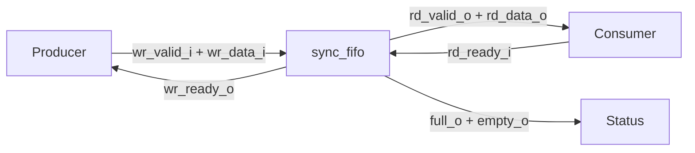
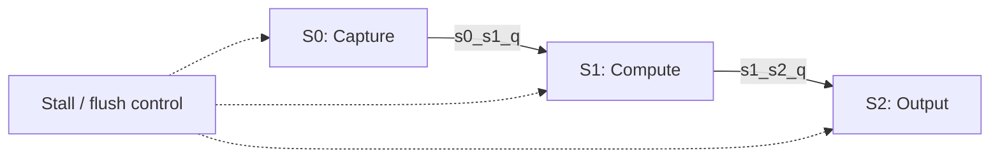
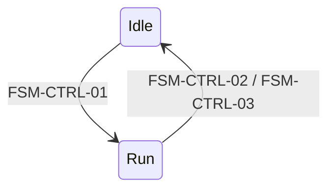

# Hardware Specification Templates

> **NON-NORMATIVE REFERENCE:** [`SKILL.md`](../SKILL.md) is the sole contract. These structures are illustrative; if any example conflicts with `SKILL.md`, follow `SKILL.md`.

Copy and adapt the smallest applicable structure. Replace illustrative names and values with decisions established through the normative workflow.

## Contents

- [Document Outlines](#document-outlines)
  - [Merged Specification](#merged-specification)
  - [Architecture Specification](#architecture-specification)
  - [Microarchitecture Specification](#microarchitecture-specification)
- [Architecture Tables](#architecture-tables)
  - [Parameters](#parameters)
  - [Interfaces and Protocol](#interfaces-and-protocol)
  - [Functional Requirements](#functional-requirements)
  - [Timing Requirements](#timing-requirements)
- [Microarchitecture Tables](#microarchitecture-tables)
  - [Sub-Block Decomposition](#sub-block-decomposition)
  - [Internal Signals and Storage](#internal-signals-and-storage)
  - [Pipeline Stages](#pipeline-stages)
  - [FSM States and Transitions](#fsm-states-and-transitions)
  - [Reset Behavior](#reset-behavior)
  - [Critical Timing Paths](#critical-timing-paths)
  - [Requirement Mapping](#requirement-mapping)
- [Test Plan Tables](#test-plan-tables)
- [Assertion and Coverage Examples](#assertion-and-coverage-examples)
- [Mermaid Diagram Archetypes](#mermaid-diagram-archetypes)

## Document Outlines

### Merged Specification

```markdown
# <Block Name> Specification

## Purpose
## Parameters
## Interfaces
## Functional Requirements
## Timing Requirements
## Reset-Visible Behavior
## Non-Goals
## Block Diagram
## Interface Timing
## Implementation Detail
### Sub-Block Decomposition
### Internal Signals and Storage
### FSM Definitions               <!-- include only when applicable -->
### Reset Behavior
### Critical Timing Paths
### Requirement Mapping
## Test Plan
### Functional and Timing Tests
### FSM Transition Tests          <!-- include only when applicable -->
### Corner and Parameter Tests
### Assertions
### Coverage
```

### Architecture Specification

```markdown
# <Block Name> Architecture Specification

## Purpose
## Parameters
## Interfaces
## Functional Requirements
## Timing Requirements
## Reset-Visible Behavior
## Non-Goals
## Block Diagram
## Interface Timing
```

### Microarchitecture Specification

```markdown
# <Block Name> Microarchitecture Specification

Companion architecture: `<block>_arch.md`

## Block Diagram
## Sub-Block Decomposition
## Internal Signals and Storage
## Pipeline Stages               <!-- include only when applicable -->
## FSM Definitions               <!-- include only when applicable -->
## Reset Behavior
## Critical Timing Paths
## Requirement Mapping
## Test Plan
### Functional and Timing Tests
### FSM Transition Tests         <!-- include only when applicable -->
### Corner and Parameter Tests
### Assertions
### Coverage
```

## Architecture Tables

### Parameters

```markdown
| Parameter | Type | Default | Legal Values / Constraints | Derived? | Description |
|-----------|------|---------|----------------------------|----------|-------------|
| DataWidth | int unsigned | 32 | >= 1 | No | Data width in bits |
| Depth | int unsigned | 16 | Power of 2 and >= 2 | No | Number of stored entries |
| AddrWidth | int unsigned | $clog2(Depth) | Determined by Depth | Yes | Address width |
```

Describe illegal combinations directly below the table when a single row cannot express them clearly.

### Interfaces and Protocol

```markdown
### Clock and Reset

| Port | Direction | Width | Domain | Description |
|------|-----------|-------|--------|-------------|
| clk_i | input | 1 | — | Rising-edge clock |
| rst_ni | input | 1 | clk_i | Active-low asynchronous assertion; deassertion assumptions are in TR-04 |

### Write Channel

| Port | Direction | Width | Domain | Description |
|------|-----------|-------|--------|-------------|
| wr_valid_i | input | 1 | clk_i | Producer presents a write payload |
| wr_ready_o | output | 1 | clk_i | Consumer can accept the payload |
| wr_data_i | input | DataWidth | clk_i | Write payload |

**Protocol:** Valid/ready. The producer may assert `wr_valid_i` independently of `wr_ready_o`. A transfer occurs when both are high at a rising edge. If no transfer occurs after valid is asserted, the producer holds `wr_valid_i` and `wr_data_i` stable while stalled. After a transfer, the producer may present a new payload on the next cycle while keeping `wr_valid_i` high. Backpressure and combinational-path rules are defined by FR-02 and TR-03.
```

### Functional Requirements

```markdown
| ID | Requirement |
|----|-------------|
| FR-01 | A write transfer stores the sampled payload exactly once. |
| FR-02 | When storage is full, the write channel applies backpressure and accepts no transfer. |
| FR-03 | A simultaneous read and write while neither boundary blocks a channel completes both transfers. |
```

### Timing Requirements

```markdown
| ID | Requirement | Value / Constraint | Reference Points |
|----|-------------|--------------------|------------------|
| TR-01 | Write-to-read latency | 1 cycle | Accepted write at edge N to readable output during cycle N+1 |
| TR-02 | Sustained throughput | 1 item/cycle | Consecutive accepted transfers with no boundary stall |
| TR-03 | Write ready path | No combinational input-to-ready path | Inputs at block boundary to wr_ready_o |
| TR-04 | Reset recovery | 1 cycle | Reset deassertion edge to first permitted transfer |
```

## Microarchitecture Tables

### Sub-Block Decomposition

```markdown
| Sub-Block | Function | Inputs | Outputs | State / Storage |
|-----------|----------|--------|---------|-----------------|
| Write control | Accept and address writes | wr_valid_i, full_q | wr_ready_o, wr_en | wr_ptr_q |
| Occupancy control | Track stored entries | wr_en, rd_en | full_o, empty_o, count_o | count_q |
```

### Internal Signals and Storage

```markdown
| Signal | Width | Kind | Owner | Description |
|--------|-------|------|-------|-------------|
| wr_en | 1 | combinational | Write control | Accepted write transfer |
| wr_ptr_q | AddrWidth | register | Write control | Address of next write |
| wr_ptr_d | AddrWidth | combinational | Write control | Next write pointer |
| mem | Depth x DataWidth | register array | Storage | FIFO payload storage |
```

### Pipeline Stages

```markdown
| Stage | Function | Inputs | Outputs | Inter-Stage Registers | Advance Condition | Stall Behavior | Bubble / Replay | Flush Behavior |
|-------|----------|--------|---------|-----------------------|-------------------|----------------|-----------------|----------------|
| S0 | Capture operands | in_valid_i, a_i, b_i | decoded operands | s0_valid_q, s0_a_q, s0_b_q | in_valid_i && in_ready_o | Hold all S0 registers | Preserve existing bubble; no replay | Clear s0_valid_q |
| S1 | Compute result | S0 registers | product | s1_valid_q, s1_product_q | pipe_advance | Hold all S1 registers | Propagate S0 validity | Clear s1_valid_q |
```

### FSM States and Transitions

```markdown
#### States

| State | Encoding | Outputs / Actions | Description |
|-------|----------|-------------------|-------------|
| Idle | 1'b0 | busy_o=0 | Wait for a request |
| Run | 1'b1 | busy_o=1 | Process the accepted request |

#### FSM Transitions

| ID | From | To | Condition | Priority | Actions |
|----|------|----|-----------|----------|---------|
| FSM-CTRL-01 | Idle | Run | req_valid_i && req_ready_o | 1 | Capture request |
| FSM-CTRL-02 | Run | Idle | done | 1 | Publish completion |
| FSM-CTRL-03 | Run | Idle | flush_i | 0 (highest) | Discard operation |
```

### Reset Behavior

```markdown
| State / Storage | Reset Value | Reset Style | Rationale / No-Reset Justification |
|-----------------|-------------|-------------|------------------------------------|
| state_q | Idle | asynchronous assertion | Establish idle control state |
| count_q | '0 | asynchronous assertion | Establish empty occupancy |
| mem | Not reset | — | Reads are architecturally invisible while count_q is zero |
```

### Critical Timing Paths

```markdown
| Path | From -> To | Concern | Safe Mitigation |
|------|------------|---------|-----------------|
| Full detection | count_q -> full_o / wr_ready_o | Comparator on ready path | Keep full_o combinational from current registered occupancy, or register full_o from next-state count_d for the following cycle; never register stale current-state status. |
| Read data | mem[rd_ptr_q] -> rd_data_o | Depth-wide read mux | Accept the documented path or add a dedicated output register and update latency requirements. |
```

### Requirement Mapping

```markdown
| Requirement | Implementing Mechanism | Notes |
|-------------|------------------------|-------|
| FR-01 | wr_en, mem write, wr_ptr_d | One write per accepted transfer |
| FR-02 | full_o and wr_ready_o | Current occupancy blocks full writes |
| TR-01 | Registered memory write and combinational read | One-cycle empty-to-readable behavior |
```

## Test Plan Tables

### Functional and Timing Tests

```markdown
| ID | Maps To | Description | Stimulus | Expected Observation | Timing | Completion |
|----|---------|-------------|----------|----------------------|--------|------------|
| T-01 | FR-01 | Single accepted write | Assert wr_valid_i with payload A while ready | One stored A; occupancy increases once | Acceptance edge through next state | One accepted write and matching occupancy check |
| T-02 | FR-02 | Write attempt while full | Hold wr_valid_i high at full occupancy | wr_ready_o=0; no write transfer | Entire bounded full interval | No acceptance before the interval ends |
| T-03 | TR-01 | Measure write-to-read latency | Write A into an empty block | A is readable exactly 1 cycle later | Edge N through cycle N+1 | Expected valid and payload observed at N+1 |
| T-04 | TR-02, FR-03 | Sustained simultaneous traffic | Drive valid and ready continuously away from boundaries | One read and one write complete per cycle | Configured traffic window | Every window edge accepts both channels |
```

### FSM Transition Tests

```markdown
| ID | Maps To | Stimulus | Expected Observation | Timing | Completion |
|----|---------|----------|----------------------|--------|------------|
| T-10 | FSM-CTRL-01 | Present and accept a request in Idle | State becomes Run; request captured | Acceptance edge through next state | Run state and captured request observed |
| T-11 | FSM-CTRL-02 | Assert done in Run | State becomes Idle; completion published | Done edge through next state | Idle state and completion observed |
| T-12 | FSM-CTRL-03 | Assert flush_i in Run with done also high | Flush wins; state becomes Idle; operation discarded | Simultaneous-event edge through recovery | Idle state with no completion observed |
```

### Corner and Parameter Tests

```markdown
| ID | Maps To | Description | Stimulus | Expected Observation | Timing | Completion |
|----|---------|-------------|----------|----------------------|--------|------------|
| T-20 | FR-01, TR-04 | Reset during activity | Assert reset with stored data | State becomes reset state; first later transfer obeys TR-04 | Reset edge through recovery interval | Reset outputs and first legal transfer observed |
| T-21 | FR-02 | Full-boundary simultaneous events | Attempt read and write while full | Result matches the selected FR-02 boundary behavior | Boundary edge through next state | Both channel outcomes and occupancy checked |
| T-22 | FR-01 | Minimum legal depth | Elaborate with Depth=2 and wrap pointers | Ordering and occupancy remain correct | More than one pointer wrap | All accepted items checked in order with no pending result |
```

Every illustrative test row carries its mapping in the same row; a separate traceability table is unnecessary.

## Assertion and Coverage Examples

These examples check behavior across time rather than restating combinational assignments:

```markdown
### Assertions

- `ASSERT_COUNT_RANGE`: `count_q <= Depth`
- `ASSERT_COUNT_INC`: `wr_en && !rd_en |=> count_q == $past(count_q) + 1`
- `ASSERT_COUNT_DEC`: `!wr_en && rd_en |=> count_q == $past(count_q) - 1`
- `ASSERT_WRITE_STALL_STABLE` (environment assumption): `wr_valid_i && !wr_ready_o |=> wr_valid_i && $stable(wr_data_i)`
- `ASSERT_READ_STALL_STABLE`: `rd_valid_o && !rd_ready_i |=> rd_valid_o && $stable(rd_data_o)`

### Coverage

- `CVR_FULL_TO_NOT_FULL`: observe a read transfer from full occupancy
- `CVR_SIMULTANEOUS_RW`: observe read and write transfers on the same edge
- `CVR_PTR_WRAP`: observe each pointer wrap at the configured depth
```

## Mermaid Diagram Archetypes

### Block Diagram



- `sync_fifo` owns storage, pointers, occupancy, and both channel contracts.
- Arrows show producer and consumer signal direction; internal storage remains in the microarchitecture table.

### Waveform Table

```text
cycle        :  0    1    2    3
wr_valid_i   :  0    1    1    0
wr_ready_o   :  1    1    1    1
wr_data_i    :  -    A    B    -
rd_valid_o   :  0    0    1    1
rd_ready_i   :  0    0    1    1
rd_data_o    :  -    -    A    B
```

- Columns show values sampled at one rising edge.
- A transfer occurs only where valid and ready are both 1 in the same column.

### Pipeline Diagram



- Named inter-stage registers match the pipeline table.
- The control path shows which stages hold or clear together.

### FSM Sketch



- Transition conditions and priority remain in the authoritative transition table.
- The sketch communicates state shape only.
